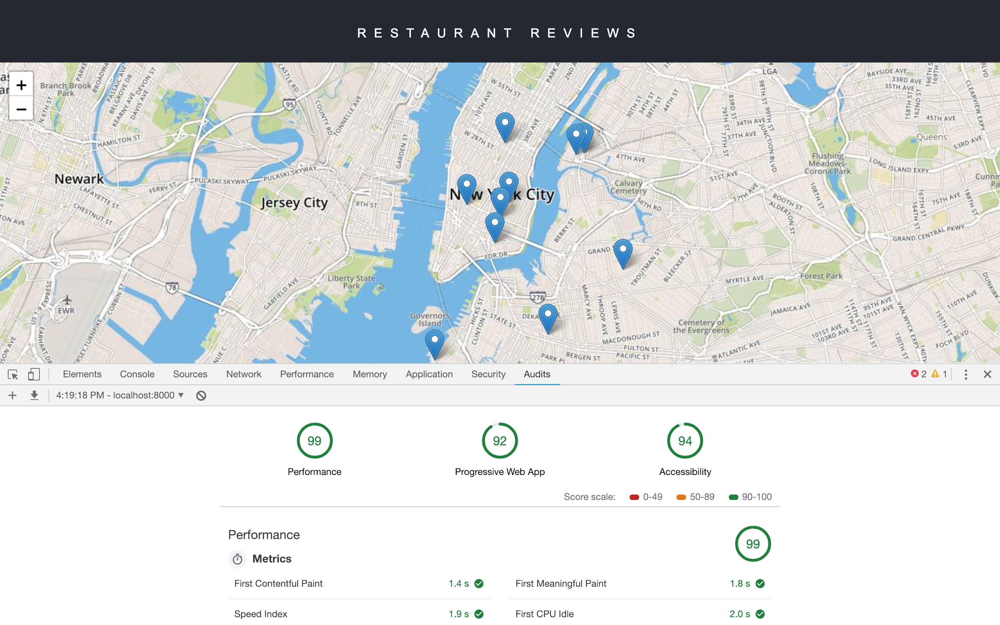

# Mobile Web Specialist Certification Course
---
#### _Three Stage Course Material Project - Restaurant Reviews_

## Project Overview: Stage 3
For the **Restaurant Reviews** projects, you will incrementally convert a static webpage to a mobile-ready web application. In **Stage Three**, you will take the connected application you yu built in **Stage One** and **Stage Two** and add additional functionality. You will add a form to allow users to create their own reviews. If the app is offline, your form will defer updating to the remote database until a connection is established. Finally, you’ll work to optimize your site to meet even stricter performance benchmarks than the previous project, and test again using [Lighthouse](https://developers.google.com/web/tools/lighthouse/).

### Specification
You will be provided code for an updated [Node development server](https://github.com/udacity/mws-restaurant-stage-3) and a README for getting the server up and running locally on your computer. The README will also contain the API you will need to make JSON requests to the server. Once you have the server up, you will begin the work of improving your **Stage Two** project code.

This server is different than the server from **Stage Two**, and has added capabilities. Make sure you are using the **Stage Three** server as you develop your project. Connecting to this server is the same as with **Stage Two**, however.

You can find the documentation for the new server in the README file for the server.

Now that you’ve connected your application to an external database, it’s time to begin adding new features to your app.

### Requirements
**Add a form to allow users to create their own reviews:** In previous versions of the application, users could only read reviews from the database. You will need to add a form that adds new reviews to the database. The form should include the user’s name, the restaurant id, the user’s rating, and whatever comments they have. Submitting the form should update the server when the user is online.

**Add functionality to defer updates until the user is connected:** If the user is not online, the app should notify the user that they are not connected, and save the users' data to submit automatically when re-connected. In this case, the review should be deferred and sent to the server when connection is re-established (but the review should still be visible locally even before it gets to the server.)

**Meet the new performance requirements:** In addition to adding new features, the performance targets you met in **Stage Two** have tightened. Using Lighthouse, you’ll need to measure your site performance against the new targets.

- **Progressive Web App** score should be at 90 or better.
- **Performance** score should be at **90** or better.
- **Accessibility** score should be at 90 or better.

### Steps to complete
1. Fork and clone the [server repository](https://github.com/udacity/mws-restaurant-stage-3). You’ll use this development server to develop your project code.
2. Continue with your **Stage Two**, add a form to allow users to submit their own reviews.
3. Add functionality to defer submission of the form until connection is re-established.
4. Follow the recommendations provided by Lighthouse to achieve the required performance targets.
5. Submit your project code for review.

